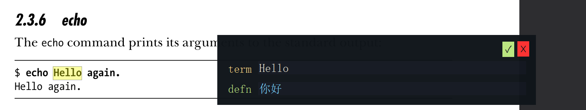

# voc
A minimal, clean, local vocabulary dictionary tool.

## Important
You must place `words.json` in the **same directory** as `voc.py` or `voc.exe`.
This file is your local word database.

## Screenshot


## Quick Start
1. Install required dependencies first:
```console
pip install -r requirements.txt
```

2. Run the tool:
```console
python voc.py
```

## Build to EXE
```console
pyinstaller --onefile --add-data "fonts/IosevkaTerm.ttf;fonts" --windowed voc.py
```
